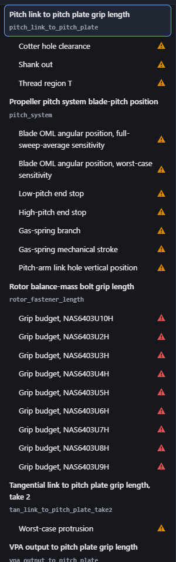
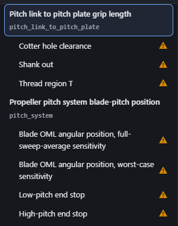
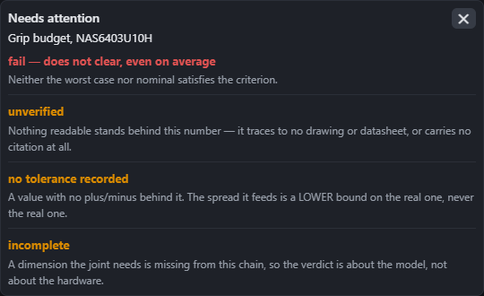

# LESSONS 2026-09-22 — viewer_nav_verdict_into_alert_and_icon

The nav rail now states **one** thing per row: a drawn status icon, with the
verdict and every alert in the card it opens. No verdict pill, no flag, no chip
of any kind, and no `⚠` character anywhere on the rail.

What follows is only what the code and the git history do not already say.

---

## The icon: a path, not a glyph, and not an emoji

The handoff left the choice open ("inline SVG or an emoji-class glyph —
whichever survives the type scale legibly at nav row size"). It is **one inline
SVG path**, and the reasoning is worth keeping because it is not aesthetic:

1. **A character is sized by `font-size`.** So it can only ever be as large as a
   step on the type scale — and the six steps are owned by
   `tests/test_app_type_scale.py` and `docs/DESIGN_TYPE_AND_COLOUR.md`. Adding a
   seventh to make one triangle bigger is a *scale* decision taken by an icon,
   in a scale whose stated principle is that a step exists because a kind of
   *text* exists.
2. **U+26A0 renders through whatever font the platform picks for it**, and on
   Windows that is as often a **colour emoji** as a monochrome glyph. A colour
   emoji ignores `color`. The level class setting red-or-amber is the entire
   mechanism by which the rail is scannable, so a platform font substitution can
   silently overrule the one thing the mark is there to say. This is the reason
   an emoji was rejected rather than chosen — "replace it with a proper
   icon/emoji" reads as either being fine, and an emoji is the worse of the two
   for exactly the state-colour reason.

A path has neither problem: pixel-sized independent of the scale
(`VA.WARNING_ICON_PX`, 16), identical on every platform, and `currentColor`
makes the level class the only thing deciding its colour.

**One path, `fill-rule: evenodd`**, so the bar and the dot are *cut out* of the
triangle rather than drawn over it. A two-path icon needs a second colour to
fill the counters with, and the only correct value for that colour is "whatever
is behind the row" — which a fill cannot name (the row tints on hover and on
selection). This is the sort of thing that looks fine on a dark page and turns
into two grey blobs the moment a row is highlighted.

`VA.WARNING_ICON_PX` is documented in `docs/DESIGN_TYPE_AND_COLOUR.md` beside
the row geometry that is already owned in JS, **with the explicit note that it
is not a precedent for a bare `px` font-size**. It would otherwise read as one.

## The quiet-row decision: nothing, not a quiet variant

The handoff asked for one or the other ("either nothing or the quiet variant of
the icon (pick one, apply everywhere)"). **A row with nothing to say wears
nothing.**

This reverses 2026-09-15's reading — that a blank row on a rail of verdicts
reads as a row that passed. That was true while the rail was a rail of
*verdicts*. It is a rail of *things to look at* now, and silence is the intended
reading. The alternative (a grey or green mark on every clean row) spends the
reader's attention on 21 rows to say "nothing here", which is the loudness this
pass exists to remove, re-introduced in a lower-contrast colour.

**But measure before trusting it: no live row is silent.** The live tally,
pinned in `tests.js`:

| | |
|---|---|
| study rows | 21 — **11 amber, 10 red, 0 silent** |
| leaf (loose-stack) rows | 2 — **1 amber, 1 red, 0 silent** |

The 10 red studies are the nine `rotor_fastener_grip_u*h` variants plus
`vpa_output_shank_out`. Every one of the other 11 either misses its criterion,
has no criterion, does not sum, or carries an unverified value.

So the quiet row is today a **promise about data that has not arrived**, and its
branch is covered by the synthetic tier, never by a real row. That is stated in
the `[real]` test as `eq(seen.silent, 0)` with a comment saying a red on that
line means a stack got *better* — read the loop, then move the number. **The
annotate rail can copy the decision, but should not expect to see it**: if its
own data is similarly flagged everywhere, "a clean row shows nothing" will look
like dead code.

## What the handoff did not ask for, and why I did it anyway

**A loose stack's row derives its own verdict** (`VA.stackVerdict`). Deliverable
3 says whatever a row showed before maps onto the one-icon scheme, and a stack
row showed *counts* — so mapping the counts over was the literal reading, and
the first version of this work did exactly that.

The live data broke it on both of the two rows it was tried against:

* **`hub_bearing_thermal_fit_m1` fails** `lower_seat__sleeve_to_bearing__hot`.
  Amber there means a reader scanning for red skips the one stack on the rail
  that fails. This pass is what makes red *mean* "fails", so shipping a tier
  that cannot say it makes the red not worth scanning for — on every tier, not
  just that one.
* **`hub_bearing_thermal_fit_m2` has an empty alert list** — all 8 values
  traced, no zero-width element — **while two of its result checks are
  `marginal`.** An alerts-only leaf row drew it **silent**. A silent row
  carrying a marginal result is the quiet-row promise broken on the first row it
  met.

The care needed: **minus the sensitivity probes.** A probe is the same check
with an undocumented input moved, and the stack page stamps it `NOT A RESULT`.
Two of m1's three failing checks are its `__k0`/`__k1` probes, and m2's worst
verdict *including* probes is `marginal` from a probe as well as from results.
Drawing a row red on a what-if is "true of the model, false of the hardware".

And the boundary I did **not** cross: a stack gets no "no pass/fail criterion
recorded yet", the way `VA.studyVerdict` writes one for a study with
`checks: []`. Nothing in the stack projection says a stack was *meant* to have a
criterion, so a row reporting the criterion missing would be the viewer
inventing the expectation it then reports against.

## The bug no test could have caught, found by looking

`.navtree__row` has `flex-wrap: wrap`. It is there for the **topology** row,
whose id sits on a second line under its name — and before that it was what the
retired `.navtree__chips` strip used (`flex-basis: 100%`) to take a line of its
own.

Left on, it puts the status icon on a **third line of its own, left-aligned
under the text**, on every row whose name needs two lines (two live study rows
in 300px: the two `Blade OML angular position, …` studies). The markup is
identical, the classes are identical, and the DOM shim's geometry is identical —
so the fast tier was green and the rail looked wrong.

Found by taking the screenshot the definition of done asked for. **The
screenshot was not documentation of finished work; it was the only test that
ran on this.** Now pinned in the browser tier ("the mark stays at the end of its
row"), verified by muting the rule: 211/212, and it names the offending rows.

Fix: `.navtree__row--study, .navtree__row--stack { flex-wrap: nowrap; }`. The
label already carries `min-width: 0`, so with no wrap it shrinks below its
max-content width and takes two lines while the mark stays at the row's end.

## A latent brittleness the layout change exposed

The browser tier's crop-lightbox wheel check asserted `window.scrollY === 0`
after the gesture. Getting the launcher on screen is itself a scroll (Playwright
scrolls a target into view before clicking it), so that zero was a fact about
how tall the rest of the page happened to be — and one-line nav rows made the
page shorter, landing it at 26. The check's *meaning* is that the **wheel**
scrolled nothing, so it now measures the delta from the offset at open.

Worth knowing generally: **a layout change in the nav rail can turn a check red
anywhere on the page** that assumed a scroll position rather than measuring one.
This was the only such site.

## Screenshots (100% zoom, `deviceScaleFactor: 1`)

Measured on the live projection: the mark renders **16×16 px** against a **13px**
label in a **30px** row.

The rail at rest — names carry the structure, one mark per row at the right
edge, and the block of `rotor_fastener_length` failures is scannable as red
against amber without reading a word:



The rows at actual size, which is the legibility claim:



The card the icon opens — the verdict first, in the verdict's own colour and in
plain words (`VA.VERDICTS`' `says`), then each alert with its *why*:



## Left for someone else

* `ISSUE_20260922_the_alert_glyph_is_still_a_character_on_two_rails` — the
  elements table's badge and `apps/annotate`'s both still type `⚠`, and both
  reasons above apply to them unchanged. Note `apps/annotate/run_tests.cjs`
  asserts `ALERT_ICON` is one glyph and not letters: that is a real guard
  written against a *character*, so moving that site means replacing the check
  with the drawn icon's shape, not deleting it.
* `ISSUE_20260916_..._left_side_menu_jeff_called_loud` — "Still open (2)" is
  closed by this pass (appended there, with what the live leaf rows taught).
  "Still open (1)", the materials table's source column, is now genuinely the
  last loud surface, and the issue stays `open` for it.

## Running the tiers from a worktree

Both viewer tiers take `--repo`, and the app's own files always come from the
worktree — only `data/` is re-pointed:

```
node apps/viewer/run_tests.cjs --repo C:\workspace\tolstack
node scripts/run_viewer_browser_tests.mjs --repo C:\workspace\tolstack
```

The browser one additionally needs `playwright-core`, and `node_modules/` is
gitignored — so it exists only in the main checkout. A **directory junction**
from the worktree to `C:\workspace\tolstack\node_modules` is enough
(`New-Item -ItemType Junction`), and it costs nothing. **Remove it before you
finish**: it is a link into the main checkout, and a cleanup that recurses
through it rather than deleting the link would take the main checkout's
`node_modules` with it. I removed mine.

`[topology file://]`'s **respine** sub-checks are mildly timing-sensitive — the
reported `scrollLeft 796 -> 78x -> 742` middle value differs run to run, and one
run of mine failed there and passed on a re-run with no change in between. Not
introduced by this handoff; worth knowing before chasing it.
