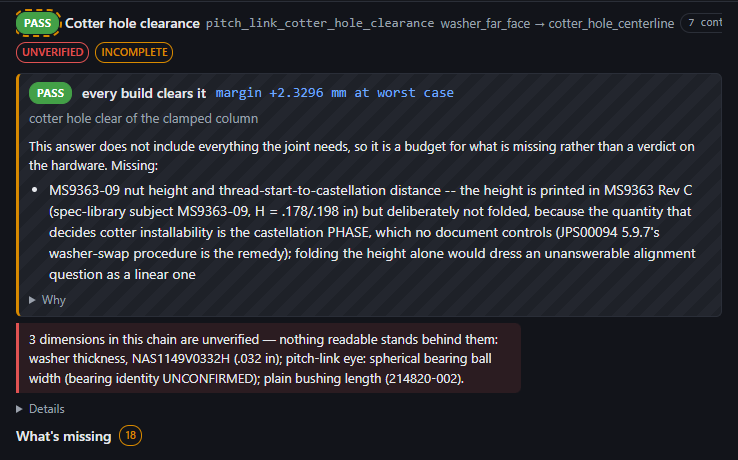
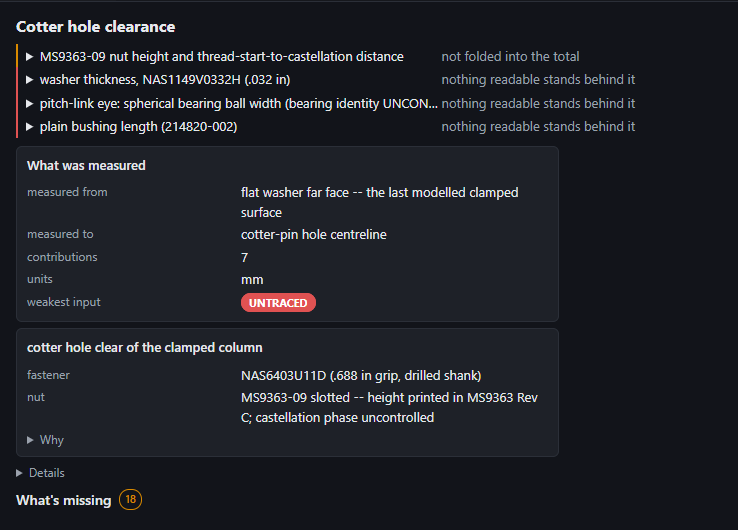
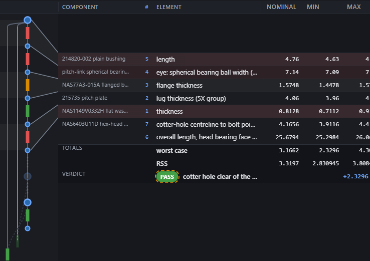
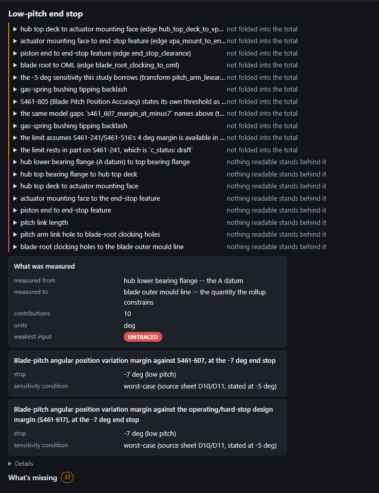

# LESSONS 2026-09-22 — viewer_summary_balance_sheet

A study's answer is a **balance sheet** now: the rolled-up numbers are footer
rows of the contributions grid, in the columns they total, and the pane below
holds a findings table and two kinds of card. The chip ribbon is gone and so
are the two paragraphs Jeff quoted.

What follows is only what the code, the commit and `apps/viewer/README.md`'s
new section do not already say.

---

## Where the work actually was — one file, not the four the handoff listed

The handoff said to *measure* which of `stack.js` / `worksheet.js` /
`detail.js` / `cards.js` owned the pieces in the screenshot. The answer is
**none of them**: every piece named — the chip ribbon, the verdict statement,
the Why/Details disclosures, "What's missing" — is `VA.renderTopoTotals` in
`apps/viewer/views/topology.js`, with its model in `apps/viewer/topology.js`.
`views/stack.js` was touched for exactly one line (exporting `kvList`).

That matters for the next reader because the two files have confusingly
similar names: `apps/viewer/topology.js` is the **model** (the page's
vocabulary and its view-models) and `apps/viewer/views/topology.js` is the
**view**. The handoff's "do not touch `topology.js`'s graph canvas" means the
`railsSvg` half of the *view*.

## The generated-vs-authored split the handoff asked me to record

Deliverable 4 said to fix the wording where prose is **generated** and to
restructure the rendering where it is **authored**. The two texts Jeff quoted
turned out to be one of each, which is why they needed different treatment:

| the text | what it was | what happened to it |
|---|---|---|
| *"This answer does not include everything the joint needs, so it is a budget for what is missing rather than a verdict on the hardware. Missing:"* | **generated** — the page's own sentence, a literal in `verdictBlock` | deleted. The `BUDGET` chip on the verdict row and the `not folded into the total` phrase on the findings row say it in three words each, and both come from tables that already existed (`VA.VERDICT_SCOPES`, `VA.GAP_KINDS`) |
| the 90-word `MS9363-09 nut height …` bullet under it | **authored** — `check.excluded_terms[0]`, in the projection | rendered, not edited: split at its own ` -- ` into a name and a rationale, name on the row, rationale in the fold, whole string on the hover and pinned by a test |
| *"3 dimensions in this chain are unverified — nothing readable stands behind them: a; b; c."* | **generated** — a sentence assembled in `verdictBlock` from `VA.studyAttention().unverified` | deleted. Three rows now; the count is the row count |
| the three dimension names inside it | **authored** — each edge's own `name` | one per row, verbatim |

**The ` -- ` convention is the finding.** Every excluded term in the live
projection that carries a reason at all separates *what* from *why* with
` -- `. That is what made a short row possible without compressing anything:
the author had already written the split, and the page was throwing it away by
rendering the whole string as one bullet. `VA.splitAuthoredFinding` reads it;
a term with no separator comes through **whole** and is clamped by CSS, never
cut at a guessed point (pinned by its own test — that case is live, e.g.
`pitch_system_end_stop_minus7`'s *"the limit rests in part on S461-241, which
is `c_status: draft`"*).

## The totals-section markup pattern, for the annotate flyout and d-c's analyses panel

The handoff asked for this to be written down so it can be copied. It is four
decisions, and three of them are load-bearing:

**1. A real `<tfoot>` of the SAME table, not a second table below it.**
`table-layout: fixed` plus the shared `<colgroup>` is the entire mechanism by
which a total lands under the column it totals. A separate table is a second
set of widths to keep in step — and this grid has a column the reader can
*drag*, so the two would diverge within one gesture. The browser tier measures
it: `a total lands in the column it totals, to the pixel` compares the `min`
cell's right edge on a member row and on the totals row (`< 0.5px`).

**2. The merged section cell is the grid's own idiom, reused.**
`<td class="tvcell tvcell--component" rowspan="2">totals</td>` — the same
class, the same rowspan, the same muted micro type a component group's merged
cell already wears. A reader who has learned "the left cell names the block"
does not have to learn anything for the footer.

**3. Which value gets the value columns is a semantic decision, not a layout
one.** The **margin** takes `nominal`+`min`+`max` as one right-aligned
colspan-3 cell — the amount column of an invoice — and the criterion goes in
the quieter `contribution` column. It is emphatically *not* placed under `min`
or `max`: which bound a criterion bites on depends on the criterion's own
direction (`>=` vs `<=`), so putting the number under one of them would be
printing a *reading* of the operator rather than the record. Every live
criterion today is `>= 0`, which is exactly the condition under which such a
guess ships and stays wrong invisibly.

**4. The verdict chip is in the name cell, not the merged section cell.** This
looks like a downgrade and is not: a study may carry more than one check, and
they need not agree. `pitch_system_end_stop_minus7` carries two —
`marginal` and `pass` — so a verdict merged over the block would have printed
one row's answer over the other's. Screenshot 4 below is that study.

Nothing about the rails moved, and the reason is worth keeping: the footer
rows sit **below** the last member row, and the grid block's centring offset
comes from `VA.rowPositions` (the plan's row **count**), not from the table's
rendered height. So no leader's seam can move no matter how many totals rows
are added. `testHeightBudget`'s `minExpected` is a floor, so a taller table
passes it unchanged.

## What I could not put in `reader_facing_bans.js`, and what I did instead

Deliverable 5 said to extend the bans file "with any wording class this pass
bans". **No new literal or shape was added, deliberately**, and the reasoning
is the useful part:

* the class this pass removed at the *page* level is **"a paragraph where a
  table belongs"**. No string list can see that — it is a fact about structure,
  not about characters. So the guard is structural: `[real] no study summary
  explains itself in a paragraph` renders every live study's summary and
  refuses any `<p>` that is not inside a `<details>`. It is the shape of guard
  to reach for the next time a "this is too wordy" review lands;
* the class it removed at the *data* level — **an internal id as a label** —
  was already expressible. `apps/viewer/tests.js`'s id walk has caught that
  since 2026-09-16; what it could not see was **a surface nobody had added to
  it**. The study summary and the grid's totals footer are now enrolled at the
  fixture tier (and a study's own id joined the id list), and that enrollment
  would have caught both leaks this pass removed by hand: the `<code>` study
  id, and `from → to` printed as `washer_far_face → cotter_hole_centerline`.

Enrolling the same surface in the **`[real]`** walk was tried and backed out —
live study `notes` name a `.py` file and live hardware gaps name `data/inbox/
specs/`, both of which the bans file refuses and both of which are the record
speaking. That is
`ISSUE_20260922_the_study_summary_renders_record_prose_the_banned_string_guard_would_refuse.md`,
and the `[real]` walk now carries a comment saying so rather than looking like
an oversight.

## Two things that look like bugs and are not

**A finding can appear twice with the same name.**
`pitch_system_end_stop_minus7` shows `gas-spring bushing tipping backlash`
twice. Two of its checks exclude that term with *different* rationales
(*"the source workbook's largest single angular contributor (0.72 deg, its row
68)…"* and *"unmodelled in this chain…"*), so they are two distinct authored
strings that happen to share everything before the ` -- `. `VA.studyAttention`
dedupes on the whole string, which is right: merging them would drop one of
the two arguments. The folds differ.

**`no plus/minus recorded — the spread is a lower bound` is a `says` phrase,
not a warning box.** The old `.tvwarn--lower-bound` block is deleted along with
`VA.zeroWidthWarning`. The claim survives as the row's reason column plus the
kind's `closes` line in the fold, and the `[real]` test now asserts **one row
per zero-width dimension** rather than one sentence naming them all — which is
strictly stronger (the old check could pass with a row's name buried in a
semicolon list).

## Scope I did not take, and why it is filed

The **loose-stack page** (`views/stack.js`) has the same two defects one page
over — `checkCard`'s five-chip head and its five `check__numbers` boxes are the
ribbon, and `check__guidance` is the essay, thirteen times on
`hub_bearing_thermal_fit_m1` (measured: a **10,634 px** tall page). It is not a
copy-paste of this work: a study's grid *is* its chain, so its totals belong
under it, while a stack's elements table is not any one check's term list —
each check folds a subset. That is a design decision, and it is
`ISSUE_20260922_the_stack_pages_check_cards_are_the_ribbon_and_the_essay_one_page_over.md`.

I did spot-check that page (`hub_bearing_thermal_fit_m1`, the thermal-fit
archetype the handoff named): it renders with no console error, joint block
and elements/materials/paths/checks sections intact. The claim that it is
*unchanged* is structural rather than a pixel comparison — the only edit to
its renderer is `VA.kvList = kvList;`, an export with no behaviour, and every
CSS selector this pass touched is `tv*`-prefixed and rendered only by
`views/topology.js`.

Also filed:
`ISSUE_20260922_the_totals_rows_put_two_required_values_in_the_grids_permanently_clipped_zone.md`
(the grid is 1218 px wide and its pane never is — the half-widths and the
criterion are behind a sideways scroll, and the row layout was chosen to keep
the verdict and the margin out of that zone) and
`ISSUE_20260922_the_balance_sheet_guards_have_no_mutation_witness_entry.md`.

## Screenshots (live projection, 1600×N, `deviceScaleFactor: 1`)

**Before** — the two texts Jeff quoted, and a chip ribbon whose numbers were
clipped off the right edge of a 738 px pane before the reader ever saw them:



**After** — the same study. Four findings as four lines, a card of what was
measured, a card of the check's own configuration with its argument behind
`Why`:



**The grid's bottom line** — `totals` under the members it totals, then the
verdict row: the chip, the check, the margin:



**The hard case** — `pitch_system_end_stop_minus7`, nineteen findings and two
checks that disagree. This is the study the old layout rendered as a wall:



## Running the tiers from this worktree

Unchanged from `LESSONS_20260922_viewer_nav_verdict_into_alert_and_icon.md`,
and it is still the fastest way in:

```
node apps/viewer/run_tests.cjs --repo C:\workspace\tolstack
node scripts/run_viewer_browser_tests.mjs --repo C:\workspace\tolstack
```

The browser one needs a `node_modules` **directory junction** into the main
checkout (`New-Item -ItemType Junction`). **Remove it before you finish** — a
cleanup that recursed through it would take the main checkout's `node_modules`
with it. Mine is removed.

One gotcha that cost me a cycle and is not written down anywhere else: the
**DOM shim has no descendant selectors**. `run_tests.cjs`'s `matcher()`
understands `tag`, `.class` and `tag.class` and nothing else, so
`all(root, "details p")` silently matches **zero** nodes in the fast tier and
everything in the browser. A guard written that way is green for the wrong
reason on the tier that runs most often. Collect fold by fold instead.

For a screenshot harness: boot over `file://` and swap `VA.FsaAdapter` for a
`MemoryAdapter` over the three real projections (the pattern
`scripts/run_viewer_browser_tests.mjs`'s `testRealDataRenderPath` uses). Doing
the same over `http://` does **not** work — `chooseTransport` prefers the
HttpAdapter there and the page lands in the hosted-unpublished state, and
stubbing `HttpAdapter.isSupported` to false lands it there too.
